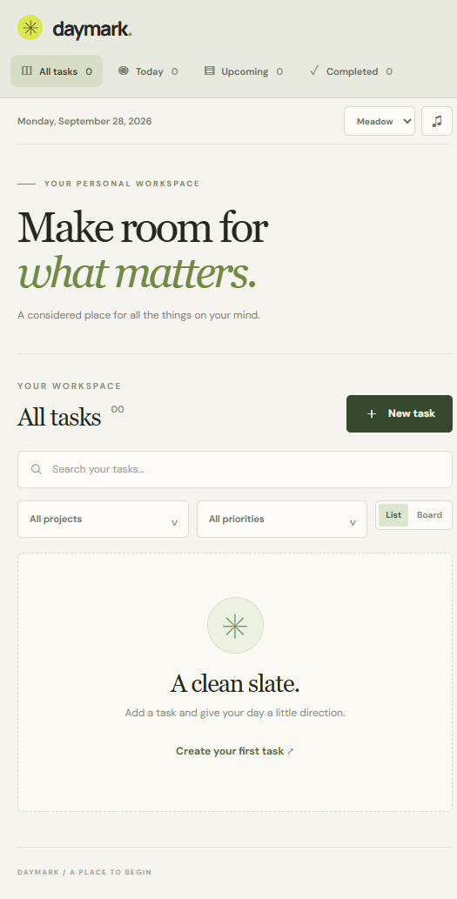

# Daymark

Daymark is a calm, local-first task manager for organizing daily work without an account or backend. It is built with semantic HTML, responsive CSS, and modern JavaScript modules.



_Kanban board view with task descriptions, subtasks, priorities, and emoji reactions._

## Features

- Create, edit, complete, and delete tasks
- Organize tasks by project and priority
- Add subtasks and track their progress
- Add descriptions and emoji reactions to tasks
- Filter by All, Today, Upcoming, or Completed
- Search task titles
- Switch between checklist and Kanban board views
- Drag tasks between To do, In progress, and Done columns
- Choose Meadow, Paper, or Night themes
- Optional completion notification sound
- Sort active tasks by due date, priority, and creation time
- Persist tasks locally with IndexedDB
- Install as a Progressive Web App
- Load the app shell offline through a versioned service worker
- Responsive layout for desktop and mobile

## Tech Stack

- HTML5 and semantic form controls
- CSS3 with responsive layout and reduced-motion support
- Vanilla JavaScript ES modules
- IndexedDB for browser persistence
- Service Worker and Web App Manifest for PWA support
- Web Audio API for lightweight, dependency-free notification feedback
- Node.js built-in test runner
- Vercel for static deployment

## Project Structure

```text
.
├── index.html                 # Application markup and task template
├── styles.css                 # Visual design and responsive layout
├── manifest.webmanifest       # PWA install metadata
├── sw.js                      # Offline app-shell caching
├── icon.svg                   # PWA icon
├── src/
│   ├── app.js                 # UI state, rendering, and event handlers
│   ├── storage.js             # IndexedDB persistence operations
│   └── tasks.js               # Date, filtering, and sorting logic
└── tests/
    └── tasks.test.mjs         # Task selection and ordering tests
```

## Run Locally

No build step is required.

For the normal UI, open `index.html` in a browser. To test the service worker and install flow, serve the project over HTTP:

```bash
python -m http.server 8080
```

Then open <http://localhost:8080>.

## Test

Run the automated tests with:

```bash
node --test tests/tasks.test.mjs
```

The tests cover task views, search and filter combinations, date handling, and ordering rules.

## Verify Offline Support

1. Start the local HTTP server or open the deployed HTTPS URL.
2. Open browser DevTools and go to **Application**.
3. Confirm that the service worker is active and the manifest is detected.
4. Create a task so IndexedDB contains local data.
5. Enable offline mode in DevTools and reload the page.
6. Confirm that the app shell still loads and the task remains available.

## Data and Privacy

Tasks are stored in the browser's local IndexedDB database named `daymark`. The application does not require an account or send task content to a server.

Clearing the site's browser storage removes local tasks.

## Deployment

Daymark is a static site and can be deployed from the repository root on Vercel:

```bash
npx vercel --prod
```

The deployed site should use HTTPS so service workers and PWA installation are available.
